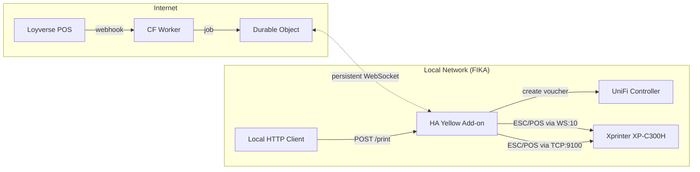

# WiFi Code Printer - System Architecture

## Overview

Automatic WiFi voucher receipt printer for FIKA Bakery. When a customer completes a purchase via Loyverse POS, a WiFi voucher is generated and a receipt is printed with a QR code for instant WiFi access.

## System Diagram



## Components

### 1. Cloudflare Worker + Durable Object (`fika-print-bridge`)

**Purpose:** Public webhook endpoint + persistent WebSocket relay to HA Yellow.

| Route | Method | Description |
|-------|--------|-------------|
| `/webhook/loyverse` | POST | Receive Loyverse sale webhook |
| `/api/print` | POST | Manual print job trigger (authed) |
| `/api/status` | GET | Connection status, job queue depth |
| `/ws` | GET | WebSocket upgrade (HA Yellow connects here) |

**Durable Object responsibilities:**
- Maintains persistent WebSocket to HA Yellow add-on
- Buffers print jobs when HA is disconnected
- Delivers buffered jobs on reconnect (FIFO)
- Heartbeat/keepalive (30s ping)
- Job deduplication by receipt ID

**Auth:**
- Loyverse webhook: HMAC signature via `X-Loyverse-Signature` header (OAuth apps) or Bearer token check (PATs)
- Manual API: Bearer token
- WebSocket: shared secret in initial handshake

### 2. HA Yellow Add-on (`wifi-code-printer`)

**Purpose:** Print server + UniFi integration running on Home Assistant Yellow.

**Interfaces:**

| Interface | Type | Description |
|-----------|------|-------------|
| HTTP API | `:3000` | Local trigger + status + health |
| WebSocket client | outbound | Connects to CF Durable Object |
| UniFi API | outbound HTTP | Create/manage vouchers |
| Printer (WS) | outbound WS `:10` | Print via WebSocket bridge |
| Printer (TCP) | outbound TCP `:9100` | Print via raw TCP (fallback + status) |

**HTTP API:**

| Endpoint | Method | Description |
|----------|--------|-------------|
| `POST /print` | POST | Generate voucher + print receipt |
| `GET /status` | GET | Printer status, connection state |
| `GET /health` | GET | Liveness check |
| `POST /test` | POST | Print test receipt (no voucher) |

**`POST /print` request:**
```json
{
  "source": "loyverse" | "manual" | "test",
  "receipt_id": "optional-dedup-id",
  "duration_hours": 24,
  "note": "optional note for UniFi"
}
```

**`POST /print` response:**
```json
{
  "ok": true,
  "voucher_code": "12345-67890",
  "ssid": "fika",
  "printed": true
}
```

### 3. Xprinter XP-C300H

**Connection:** WiFi (HF-LPT230 module) at `172.20.7.159` / `fika-printer`

| Port | Protocol | Use |
|------|----------|-----|
| 10 | WebSocket | Print (send-only, preferred) |
| 9100 | Raw TCP | Print + status queries (bidirectional) |
| 80 | HTTP | Web config (J-Speed ethernet interface) |

### 4. UniFi Controller

**Host:** UniFi Dream Machine (local network)\
**Auth:** API key via `X-API-KEY` header\
**Site:** `default`

**Voucher creation:**
```
POST /proxy/network/api/s/default/cmd/hotspot
{
  "cmd": "create-voucher",
  "n": 1,
  "expire": 1440,        // minutes (24h)
  "quota": 1,            // single-use
  "note": "FIKA WiFi - receipt #xyz"
}
```

## Loyverse Integration

**Webhook event:** `receipts.update` -- fires on sale completion (and refunds/updates)\
**API base:** `https://api.loyverse.com/v1.0`\
**Auth:** Personal Access Token via `Authorization: Bearer {token}`

**Webhook payload (simplified):**
```json
{
  "merchant_id": "...",
  "type": "receipts.update",
  "created_at": "2026-03-13T10:00:00Z",
  "receipts": [{
    "receipt_number": "2-1008",
    "receipt_type": "SALE",
    "total_money": 250.00,
    "store_id": "...",
    "line_items": [{"item_name": "Latte", "quantity": 1, "price": 120.00}, ...],
    "payments": [{"type": "CASH", "money_amount": 250.00}]
  }]
}
```

**Important:**
- Filter `receipt_type === "SALE"` (ignore REFUND)
- Deduplicate by `receipt_number` (event fires on both create AND update)
- HMAC verification via `X-Loyverse-Signature` (base64 HMAC of body using `client_secret`)
- Retries: up to 200 times over 48 hours if endpoint doesn't return 2xx
- Configure at: `https://r.loyverse.com/dashboard/#/webhooks`

## WebSocket Protocol (CF <-> HA)

Simple JSON messages over WebSocket.

### HA -> CF (upstream)

```json
// Authentication on connect
{"type": "auth", "secret": "shared-secret-here"}

// Job acknowledgement
{"type": "ack", "job_id": "abc123", "status": "printed", "voucher_code": "12345-67890"}

// Error report
{"type": "ack", "job_id": "abc123", "status": "error", "error": "printer offline"}

// Heartbeat response
{"type": "pong"}
```

### CF -> HA (downstream)

```json
// Print job
{"type": "print", "job_id": "abc123", "receipt_id": "lv-12345", "duration_hours": 24}

// Heartbeat
{"type": "ping"}

// Buffered jobs on reconnect
{"type": "print", "job_id": "abc124", "receipt_id": "lv-12346", "duration_hours": 24, "buffered": true}
```

## Receipt Layout

```
┌────────────────────────────────┐
│      [FIKA BAKERY LOGO]       │  <- 384px bitmap
│        (cupcake badge)         │
│                                │
│       ~ FREE WIFI ~            │  <- double height bold
│                                │
│  ─────────────────────────── │
│   Scan to connect automatically│
│                                │
│        ┌──────────┐            │
│        │ QR CODE  │            │  <- WiFi QR (WIFI:T:WPA;S:fika;P:CODE;;)
│        │          │            │
│        └──────────┘            │
│                                │
│  ─────────────────────────── │
│                                │
│     Or connect manually:       │
│                                │
│          Network               │
│         F I K A                │  <- double W+H bold
│                                │
│          Password              │
│      XXXXX-XXXXX              │  <- double W+H bold (voucher code)
│                                │
│  ─────────────────────────── │
│  Valid for 24h from connection │
│                                │
│     Enjoy your coffee!         │
│                                │
│  ~~~~~~~~ partial cut ~~~~~~~~ │
└────────────────────────────────┘
```

## Configuration

### HA Add-on `config.yaml` options

```yaml
options:
  unifi_host: "https://192.168.1.1"
  unifi_api_key: ""
  unifi_site: "default"
  printer_host: "fika-printer"
  printer_ws_port: 10
  printer_tcp_port: 9100
  cloudflare_ws_url: "wss://fika-print.workers.dev/ws"
  cloudflare_secret: ""
  voucher_duration_hours: 24
  voucher_quota: 1
  ssid: "fika"
```

### CF Worker Environment Variables

```
WEBHOOK_SECRET=...       # Loyverse webhook verification
API_TOKEN=...            # Manual API auth
WS_SECRET=...            # HA Yellow WebSocket auth
```

## Deployment

### HA Yellow Add-on

```bash
# SCP to HA Yellow
scp -r wifi-code-printer/ root@homeassistant.local:/addons/

# Then in HA UI:
# Settings > Add-ons > Add-on Store > ⋮ > Check for updates
# Find "WiFi Code Printer" in Local add-ons > Install
```

### Cloudflare Worker

```bash
cd cloudflare-worker/
npx wrangler deploy
```

## Credentials

| Secret | Location | Value/Reference |
|--------|----------|-----------------|
| Loyverse API Token | `/projects/fika/loyverse/.env` | `LOYVERSE_API_TOKEN` |
| Loyverse Webhook Secret | CF Worker secret `WEBHOOK_SECRET` | TBD |
| UniFi API Key | HA addon options | TBD (create in UniFi console) |
| CF Worker WS Secret | CF Worker secret `WS_SECRET` | TBD |

## Product -> WiFi Voucher Mapping

Defined in `wifi-products.json`. Only these Loyverse products (category: "Services") trigger a WiFi code print:

| Loyverse Product | Price | WiFi Duration | Devices |
|-----------------|-------|---------------|---------|
| Wifi 30 min | 0 THB | 30 min | 1 |
| Working in cafe | 100 THB | 2 hours | 1 |
| High season space B | 250 THB | 12 hours | 2 |

The CF Worker matches `line_items[].item_id` against this config. Non-matching items are ignored.

## Security

- CF Worker validates Loyverse webhook signatures
- CF <-> HA WebSocket uses shared secret auth
- UniFi API key scoped to voucher management only
- HA add-on only accessible on local network (port 3000 not exposed to internet)
- Printer WebSocket has no auth (LAN-only, acceptable)
