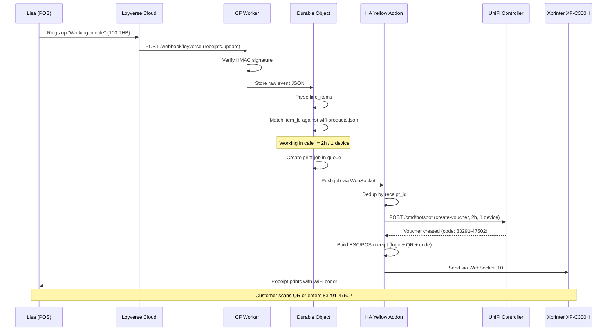

# WiFi Code Printer - Full Pipeline

## The Flow



## Component Map

```
┏━━━━━━━━━━━━━━━━━━━━━━━━━━━━━━━━━━━━━━━━━━━━━━━━━━━━━━━━━━━━━┓
┃                         INTERNET                               ┃
┃                                                                ┃
┃  ┌──────────────┐     ┌──────────────────────────────────────┐ ┃
┃  │ Loyverse POS │────>│ CF Worker (loyverse-integration)     │ ┃
┃  │ (Lisa's iPad)│     │                                      │ ┃
┃  └──────────────┘     │  Route: /webhook/loyverse            │ ┃
┃                       │  Domain: loyverse-integration         │ ┃
┃                       │         .lanta-fika.com               │ ┃
┃                       │                                      │ ┃
┃                       │  ┌────────────────────────────────┐  │ ┃
┃                       │  │ Durable Object (PrintQueue)    │  │ ┃
┃                       │  │  - Store webhook events        │  │ ┃
┃                       │  │  - Match products to WiFi rules│  │ ┃
┃                       │  │  - Queue print jobs            │  │ ┃
┃                       │  │  - WebSocket hub to HA Yellow  │  │ ┃
┃                       │  └──────────────┬─────────────────┘  │ ┃
┃                       └─────────────────┼────────────────────┘ ┃
┃                                         │                      ┃
┗━━━━━━━━━━━━━━━━━━━━━━━━━━━━━━━━━━━━━━━━┼━━━━━━━━━━━━━━━━━━━━━┛
                              persistent  │ WebSocket
                                          │
┏━━━━━━━━━━━━━━━━━━━━━━━━━━━━━━━━━━━━━━━━┼━━━━━━━━━━━━━━━━━━━━━┓
┃                    FIKA LOCAL NETWORK   │                      ┃
┃                                         │                      ┃
┃  ┌──────────────────────────────────────┴───────────────────┐  ┃
┃  │ HA Yellow Add-on (wifi-code-printer:3000)                │  ┃
┃  │                                                          │  ┃
┃  │  GET  /       Web UI (Lisa's phone)                      │  ┃
┃  │  POST /print  Generate voucher + print                   │  ┃
┃  │  POST /test   Test print                                 │  ┃
┃  │  GET  /status Printer + bridge health                    │  ┃
┃  │                                                          │  ┃
┃  │  Bridge client <--- reconnects automatically             │  ┃
┃  └────────┬────────────────────────────────┬────────────────┘  ┃
┃           │                                │                    ┃
┃           │ POST /cmd/hotspot              │ ESC/POS            ┃
┃           │ X-API-KEY auth                 │ WS:10 or TCP:9100  ┃
┃           v                                v                    ┃
┃  ┌────────────────────┐    ┌──────────────────────────────┐    ┃
┃  │ UniFi Controller   │    │ Xprinter XP-C300H            │    ┃
┃  │ (172.20.7.1)       │    │ (fika-printer / 172.20.7.159)│    ┃
┃  │                    │    │                              │    ┃
┃  │ Creates single-use │    │ Prints receipt with:         │    ┃
┃  │ WiFi voucher       │    │  - FIKA logo (bitmap)        │    ┃
┃  │ XXXXX-XXXXX        │    │  - QR code (WiFi auto-join)  │    ┃
┃  │                    │    │  - Network name (double-wide) │    ┃
┃  │ Hotspot portal     │    │  - Voucher code (BIG)         │    ┃
┃  │ validates code     │    │  - Duration + device count    │    ┃
┃  │ on guest connect   │    │  - Timestamp                  │    ┃
┃  └────────────────────┘    └──────────────────────────────┘    ┃
┃                                                                ┃
┗━━━━━━━━━━━━━━━━━━━━━━━━━━━━━━━━━━━━━━━━━━━━━━━━━━━━━━━━━━━━━━┛
```

## Product Trigger Rules

Only items in the Loyverse "Services" category trigger WiFi code prints:

| Loyverse Product | item_id | Price | Duration | Devices |
|-----------------|---------|-------|----------|---------|
| Wifi 30 min | `ca87df6b-...` | 0 THB | 30 min | 1 |
| Working in cafe | `91b96f9c-...` | 100 THB | 2 hours | 1 |
| High season space B | `32e96796-...` | 250 THB | 12 hours | 2 |

All other products (coffees, food, beer, etc.) are ignored.

## Two Entry Points

### 1. Automatic (Loyverse webhook)

```
Customer pays -> Loyverse fires webhook -> CF Worker matches product
  -> Queues job -> WebSocket to HA -> UniFi voucher -> Printer
```

Staff does nothing extra. If the receipt includes a WiFi product, a code prints automatically.

### 2. Manual (Web UI on HA)

```
Lisa opens http://ha-yellow:3000 on her phone
  -> Taps "30m" / "2h" / "12h" button
  -> HA creates UniFi voucher -> Printer
```

For walk-ins, special requests, or when Loyverse is down.

## Offline / Disconnect Handling

| Scenario | What happens |
|----------|-------------|
| HA Yellow offline | CF Durable Object buffers jobs, delivers on reconnect (FIFO) |
| Printer offline | HA retries WS:10, falls back to TCP:9100, returns error if both fail |
| UniFi offline | HA returns error, no voucher created, no receipt printed |
| CF Worker offline | Loyverse retries webhook up to 200 times over 48 hours |
| Internet down at FIKA | Manual mode via local Web UI still works (HA + UniFi on LAN) |

## Files

| File | What |
|------|------|
| `addon/index.ts` | Main server, routes, handlePrintJob, dry-run mode |
| `addon/lib/dashboard.ts` | Web UI HTML (hacker aesthetic) |
| `addon/lib/receipt.ts` | ESC/POS receipt builder (logo + QR + code) |
| `addon/lib/printer.ts` | WS:10 + TCP:9100 print + status |
| `addon/lib/unifi.ts` | UniFi voucher CRUD |
| `addon/lib/bridge.ts` | Persistent WebSocket client to CF |
| `addon/lib/escpos.ts` | ESC/POS command constants + helpers |
| `addon/config.yaml` | HA add-on metadata |
| `addon/Dockerfile` | oven/bun:1-alpine container |
| `worker/src/index.ts` | CF Worker entry |
| `worker/src/print-queue.ts` | Durable Object (queue, WebSocket, dashboard) |
| `worker/src/dashboard.ts` | CF dashboard HTML |
| `wifi-products.json` | Product -> voucher mapping config |
| `print-receipt.ts` | Standalone Bun CLI for printing receipts |
| `buzzer-config.ts` | Buzzer EEPROM config tool |
| `PRINTER-SETTINGS.md` | Complete printer reference (ESC/POS, vendor cmds, EEPROM) |
| `ARCHITECTURE.md` | System architecture + API contracts |

## Testing

```bash
# Local dry-run (no printer, no UniFi)
cd addon && DRY_RUN=1 PORT=4100 bun run index.ts

# Test endpoints
curl http://localhost:4100/health
curl http://localhost:4100/status
curl -X POST http://localhost:4100/test
curl -X POST http://localhost:4100/print \
  -H "Content-Type: application/json" \
  -d '{"duration_minutes": 30, "devices": 1, "note": "test"}'

# Open Web UI
open http://localhost:4100
```
