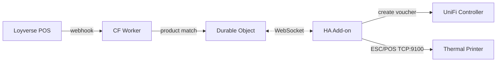

# WiFi Code Printer

```
┏━━━━━━━━━━━━━━━━━━━━━━━━━━━━━━━━━━━━━━━━━━━━━━━━━━━━━━━━━━━━━┓
┃  SALE ► WEBHOOK ► VOUCHER ► PRINT ► WIFI                      ┃
┃                                                                ┃
┃  Loyverse POS -> Cloudflare Worker -> Home Assistant -> UniFi  ┃
┗━━━━━━━━━━━━━━━━━━━━━━━━━━━━━━━━━━━━━━━━━━━━━━━━━━━━━━━━━━━━━┛
```

Automatic WiFi guest voucher printer for cafes and coworking spaces. When a customer buys a WiFi product on the POS, a UniFi hotspot voucher is generated and a thermal receipt is printed with a QR code and access code.

**Stack:** Loyverse POS, Cloudflare Workers + Durable Objects, Home Assistant (add-on), UniFi hotspot vouchers, ESC/POS thermal printing, Bun runtime.

## How It Works



1. Staff rings up a WiFi product on the Loyverse POS
2. Loyverse fires a `receipts.update` webhook to a Cloudflare Worker
3. The Worker matches the product against a configured WiFi product list
4. A print job is queued in a Durable Object and delivered via WebSocket
5. The HA add-on receives the job, creates a UniFi guest voucher
6. A receipt is printed with QR code (auto-connect) + voucher code

**Other ways to trigger:**
- **Web dashboard** - tap a preset button (30min / 2h / 12h)
- **Custom form** - any duration, device count, batch printing
- **Message printer** - general purpose announcements and notices
- **API** - `POST /print` with duration and device count

## Features

- **Auto-expire at closing time** - voucher notes stamped with closing time metadata, reaper terminates guest sessions after hours
- **Batch printing** - print multiple vouchers at once for events
- **Message printer** - custom receipts for announcements, order-ready notices, daily specials
- **Printer diagnostics** - web UI for buzzer control, density, width, status checks
- **Security** - HMAC webhook verification, basic auth dashboard, timing-safe WebSocket auth, input validation
- **25 random coffee one-liners** on every receipt

## The Receipt

```
  ┌────────────────────────────────────────┐
  │         [LOGO BITMAP]                  │
  │                                        │
  │          ~ FREE WIFI ~                 │
  │  ────────────────────────────────────  │
  │         Scan to connect                │
  │          ┌──────────┐                  │
  │          │ QR CODE  │                  │
  │          └──────────┘                  │
  │  ────────────────────────────────────  │
  │            Network                     │
  │           F I K A                      │
  │                                        │
  │     Enter this code when prompted      │
  │         83291-47502                    │
  │  ────────────────────────────────────  │
  │     2 hours - 1 device                 │
  │     Must be activated before 19:00     │
  │                                        │
  │  "Decaf is just bean-flavored          │
  │   disappointment."                     │
  │                                        │
  │     19 Mar 2026, 14:30                 │
  └────────────────────────────────────────┘
```

## Components

### Cloudflare Worker (`worker/`)

Public webhook endpoint + Durable Object message broker.

- Receives Loyverse `receipts.update` webhooks
- Matches products by `item_id` against configurable WiFi product list
- Queues print jobs in Durable Object storage (rolling cap, 100 max)
- Delivers jobs to connected consumers via WebSocket pub/sub
- Dashboard with event log, queue, and connected clients (basic auth)

### Home Assistant Add-on (`wifi-code-printer/`)

Bun server running as a Home Assistant add-on.

- Persistent WebSocket connection to CF Worker (auto-reconnect, exponential backoff)
- Creates UniFi guest vouchers via `X-API-KEY` auth
- Builds ESC/POS receipts with raster logo bitmap + native QR code
- Prints via TCP:9100 to any ESC/POS thermal printer
- **Voucher reaper** - terminates guest sessions at closing time
- **Web dashboard** (`/`) - preset buttons + custom voucher generation
- **Message printer** (`/message`) - custom announcements and notices
- **Diagnostics** (`/diag`) - buzzer, density, width, printer status

### Printer

Tested with Xprinter XP-C300H (80mm, auto-cutter, WiFi + Ethernet + USB). Should work with any ESC/POS compatible 80mm thermal printer on TCP:9100.

Includes tools for:
- WiFi configuration via USB (`xprinter-wifi-config.py`)
- Buzzer/EEPROM configuration (`buzzer-config.ts`)
- Standalone receipt printing (`print-receipt.ts`)

## Configuration

### HA Add-on Options

| Option | Description |
|--------|-------------|
| `unifi_host` | UniFi controller URL (https://...) |
| `unifi_api_key` | UniFi API key for voucher management |
| `unifi_site` | UniFi site name (default: `default`) |
| `printer_host` | Printer hostname or IP |
| `printer_tcp_port` | ESC/POS TCP port (default: 9100) |
| `bridge_url` | CF Worker WebSocket URL (wss://...) |
| `bridge_secret` | Shared auth secret for WebSocket |
| `ssid` | WiFi network name shown on receipts |
| `closing_time` | Daily closing time, e.g. `19:00` |
| `closed_days` | Comma-separated closed days, e.g. `sun` |
| `timezone` | IANA timezone, e.g. `Asia/Bangkok` |
| `reaper_interval_minutes` | How often to check for expired vouchers (default: 5) |
| `reaper_grace_minutes` | Grace period after closing before terminating (default: 5) |

### CF Worker Secrets

Set via `wrangler secret put <NAME>`:

| Secret | Description |
|--------|-------------|
| `WS_SECRET` | WebSocket auth secret (must match `bridge_secret`) |
| `WEBHOOK_SECRET` | Loyverse HMAC signature secret (optional) |
| `DASHBOARD_USER` | Basic auth username for dashboard |
| `DASHBOARD_PASS` | Basic auth password for dashboard |

### WiFi Product Mapping

Configure in `wifi-products.json` and `worker/src/print-queue.ts`:

```json
{
  "item_id": "your-loyverse-item-id",
  "item_name": "WiFi 2 Hours",
  "duration_minutes": 120,
  "devices": 1
}
```

## Installation

### HA Add-on

1. In Home Assistant: **Apps** -> **App Store** -> three dots -> **Repositories**
2. Add this repository URL
3. Find "WiFi Code Printer", install, configure, start

### CF Worker

```bash
cd worker
bunx wrangler deploy
```

### Development

```bash
# Local dry-run (no printer, no UniFi)
cd wifi-code-printer
DRY_RUN=1 PORT=4100 SSID=MyNetwork bun run index.ts

# Tail worker logs
cd worker && bunx wrangler tail --format pretty
```

## Voucher Lifecycle

1. **Create** - voucher created with generous `expire` (24h) + closing time in note
2. **Print** - receipt shows duration + "Must be activated before HH:MM"
3. **Activate** - guest scans QR, connects to WiFi, enters code in captive portal
4. **Expire** - UniFi's built-in `expire` timer starts on activation
5. **Reap** - addon's reaper checks every 5min, terminates sessions past closing time
6. **Cleanup** - reaper deletes voucher + unauthorizes guest MAC

## Files

| Path | Purpose |
|------|---------|
| `wifi-code-printer/` | HA add-on source (Bun server) |
| `wifi-code-printer/lib/` | Modules: bridge, printer, receipt, unifi, reaper, hours, diag |
| `worker/` | Cloudflare Worker + Durable Object |
| `wifi-products.json` | Loyverse product -> voucher mapping |
| `xprinter-wifi-config.py` | USB WiFi configuration tool (pyusb) |
| `buzzer-config.ts` | Printer buzzer/EEPROM config tool |
| `print-receipt.ts` | Standalone CLI receipt printer |
| `PRINTER-SETTINGS.md` | Xprinter XP-C300H ESC/POS reference |
| `ARCHITECTURE.md` | System architecture + API contracts |

## License

MIT

---

*Maintained by WOPR - "Shall we play a game? How about a nice receipt."*
